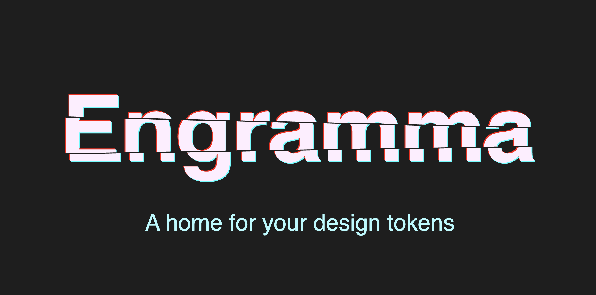

# Engramma

A web-based design tokens editor and converter for building design systems. Create, preview, and export design tokens in standard formats with preview of colors, typography, spacing, and more.



## Quick start

Open [engramma.dev](https://engramma.dev) and use the menu (top-left):

- **New Project** → start empty, or import your tokens
- **Export tokens** → copy JSON / CSS / SCSS output
- **Share URL** → copies a link that contains your current token data (handy for sharing a draft)

### Importing tokens

Menu → **New Project** → Import tab, then paste/upload:

- **JSON (DTCG 2025 specification)**: latest stable specification
- **JSON (DTCG 2022 draft)**: legacy, less strict format
- **CSS variables**: paste a `:root { --token-name: ... }` block and import

## What you can model

Engramma supports these token types:

- `color`
- `dimension` (px/rem)
- `duration` (ms/s)
- `number`
- `fontFamily`
- `fontWeight`
- `cubicBezier`
- `strokeStyle`
- `border`
- `shadow`
- `transition`
- `typography`
- `gradient`

## Aliases / references

Aliases enable a flexible, maintainable token system by creating semantic layers. Instead of scattering raw values throughout your tokens, you can:

- **Build semantic themes**: Map abstract properties (like a brand color) to meaningful UI concepts (like "background-primary"), making tokens reusable across products or brands
- **Support design variations**: Create multiple themes (dark mode, seasonal campaigns, sub-brands, white-label variants) by aliasing to different base values while keeping components unchanged
- **Reduce duplication**: Share common token values across your system without repeating them

Composite tokens can reference other tokens in their parts (e.g. color in shadow or gradient).

## Export formats

Menu → **Export tokens**:

- **JSON**: DTCG-shaped output (good for storing in git or feeding other tools)
- **CSS**: CSS custom properties (`--token-name: ...;`)
- **SCSS**: SCSS variables

If you use aliases, the exporters keep them as references/`var()` where possible instead of flattening everything.

## Web Component

Engramma is available as an embeddable web component for developers to preview and edit CSS variables with a design tokens editor directly on their page.

### Quick start

Add this to your HTML:

```html
<script
  type="module"
  src="https://unpkg.com/engramma@latest/dist/engramma.js"
></script>

<button commandfor="engramma-dialog" command="show-modal">
  Edit design tokens
</button>

<style>
  #engramma-dialog:modal {
    top: 8px;
    right: 8px;
    bottom: auto;
    left: auto;
    width: 30dvw;
    height: calc(100dvh - 16px);
    padding: 0;
    border: 0;
    box-shadow: 0 0 10px rgb(0 0 0 / 30%);
  }
  #engramma-dialog::backdrop {
    display: none;
  }
</style>
<dialog id="engramma-dialog" closedby="any">
  <engramma-app></engramma-app>
</dialog>
```

The component automatically detects all CSS variables on your page and allows you to edit them in real-time.

### How it works

The component extracts CSS custom properties from your html element (:root selector) and converts them into design tokens (colors, dimensions, typography, etc.). When you edit tokens in the editor, changes are immediately written back to CSS variables, updating your page styles instantly.

This makes it easy to:

- **Preview** your design system variables in context
- **Experiment** with changes before committing them
- **Extract** a structured token system from existing CSS variables

For deeper integration details, see [packages/engramma](./packages/engramma/README.md).

## License

This project is licensed under the [MIT License](./LICENSE).
